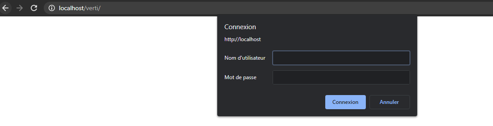

#Protéger un dossier

## Fichier .htpasswd

Pour protéger un dossier il est possible de rajouter un fichier `.htpasswd` à la racine d'un dossier.

Exemple dans le dossier /verti.

## Identifiants

Pour rajouter des identifiants, ouvrez le fichiers `.htpasswd` du répertoire protégé et rajoutez une ligne de la manière suivante:

	nom_utilisateur:mdp_en_md5

Exemple:

## Accéder au répertoire protégé

Il vous sera alors demandé un des identifiants d'une ligne de votre `.htpasswd` pour vous connecter.
Attention, le mot de passe demandé est celui qui n'est pas en MD5.

