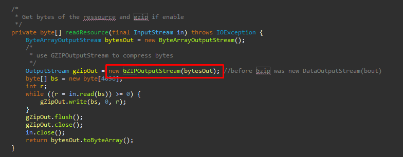
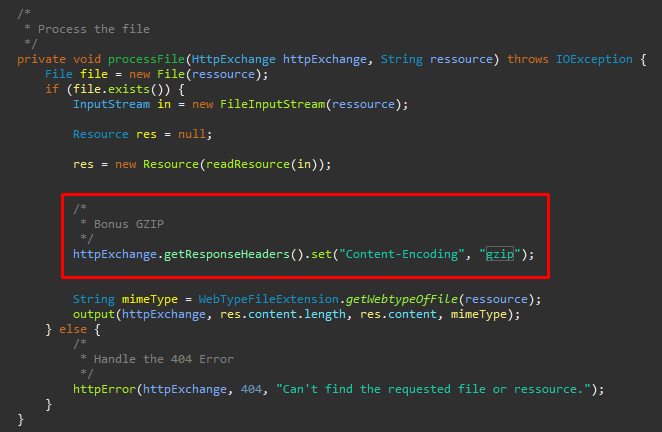
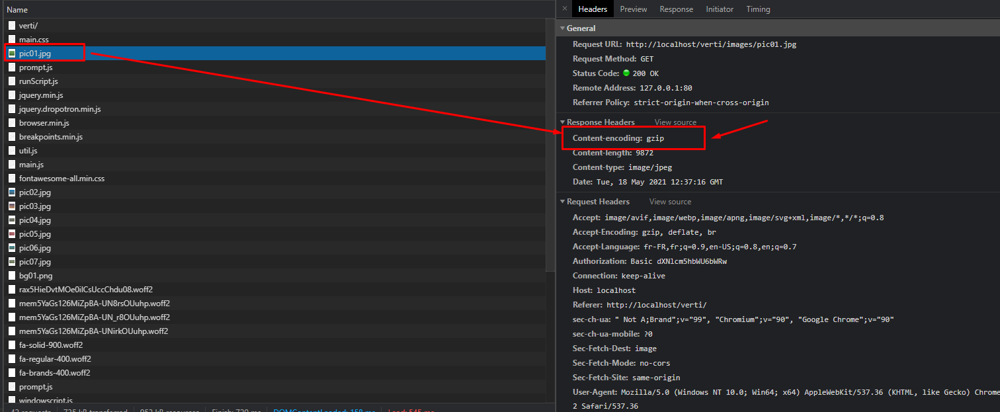
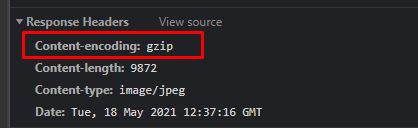

#Compression GZIP des ressources

## Fonctionnement du code

Afin de compresser nos ressources, il a fallu compresser les bytes avec un utilitaire GZIP présent dans Java.

De plus il fallait changer le type des ressources pour que le navigateur comprenne qu'il s'agissait des ressources compréssées.

## Vérification du fonctionnement

Pour vérifier que nos ressources sont bien compréssées, on peut utiliser l'outil de développement de Google Chrome.
On se rend ensuite dans la liste de nos ressources et on peut voir le type de compression de ces dernières.

Prenons par exemple la ressource pic01.jpg

On voit alors que le type d'encodage est bien gzip et que le navigateur arrive a bien l'interpréter.

