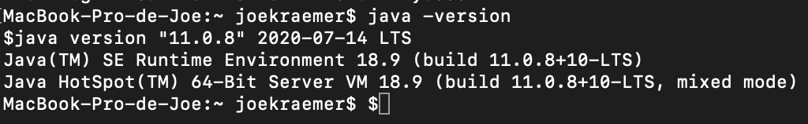
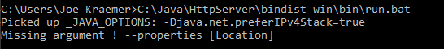
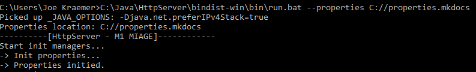

# Comment lancer l'application ?

# Prérequis

Afin de lancer l'application, il vous faudra Java sur votre Machine.
La version utilisée pour ce projet est Java 11.

Vous pouvez vérifier la version de votre Java en tappant `java -version` dans votre cmd/terminal.

Maintenant il vous faut déterminer sur quel OS vous vous trouvez, ensuite suivez l'explication correspondante:

# Sur Microsoft Windows

Commencez par localiser votre fichier `HttpServer-0.0.1-SNAPSHOT-src.zip` puis extrayez-le.
Rendez vous ensuite dans le dossier extrait et finalement dans le dossier `bindist-win`, ensuite "bin" et lancez `run.bat`.

Vous devriez avoir une erreur:

Ceci vous indique qu'il vous manque l'argument `--properties {location}` il vous faut donc spécifié via un argument l'endroit où vous souhaitez avoir votre fichier de propriété.

Voici un exemple:

Le serveur est alors lancé, félicitations.

# Sur un système Unix / Linux / Apple Mac OS

Commencez par localiser votre fichier `HttpServer-0.0.1-SNAPSHOT-src.zip` puis extrayez-le.
Rendez vous ensuite dans le dossier extrait et finalement dans le dossier `bindist-unix`, ensuite "bin" et lancez `run`.

Vous devriez avoir une erreur qui vous dit qu'il manque un argument.
Ceci vous indique qu'il vous manque l'argument `--properties {location}` il vous faut donc spécifié via un argument l'endroit où vous souhaitez avoir votre fichier de propriété.
Il vous faut donc faire `./run --properties {votre localisation}`.

Le serveur est alors lancé, félicitations.

# Erreur commune

Il se peut que vous rencontriez cette erreur:

`[ERROR] During server starting : java.net.BindException: Address already in use: bind`

Cela veut dire que vous avez soit le port du serveur qui est déjà utilisé, soit que vous avez deux instance du programme.
