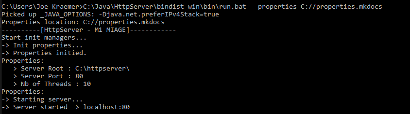
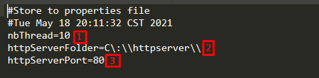
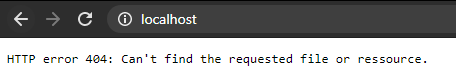
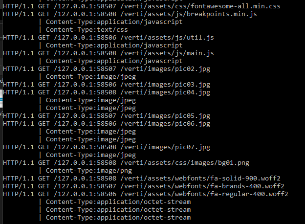
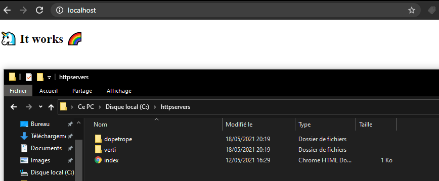
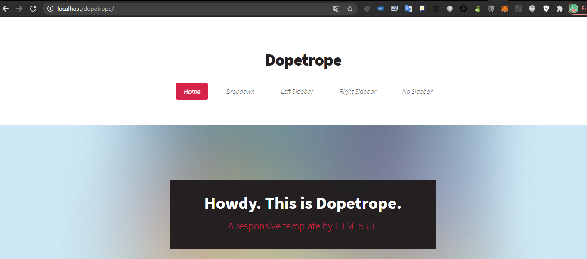
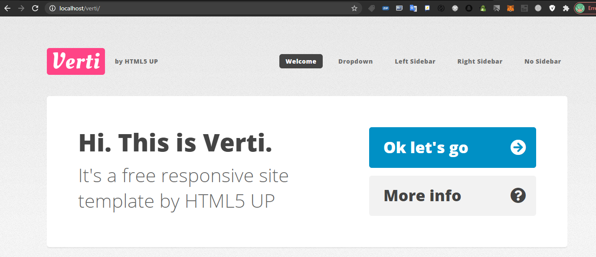

# Guide d'utilisation

## Aperçu

Lorsque le serveur est correctement lancé, vous devriez avoir des informations similaire dans votre console.

## Fichier properties
 
Lorsque vous lancez le serveur pour la première fois, un fichier de propriété est créer à la location que vous avez définit dans votre argument --properties.
Il est de base remplie avec ces informations:

Description des propriétés:

	1 - Nombre de threads concurrents maximums
	2 - Dossier dans lequel se trouve les fichiers de vos sites
	3 - Port du serveur
	
Une fois le serveur éteins, vous pouvez alors éditer les propriétés et relancer le serveur avec le même paramètre pour l'endroit des propriétés.

## Premier accès au localhost

Lors de votre premier accès, si vous n'avez mis aucun fichier dans le dossier de votre serveur web, vous devriez tombé sur une erreur 404.

### Détail des requêtes

Lorsque vous accéder à un site, vous aurez dans la console le retour des requêtes.

Vous pourrez voir :

	- Le protocol
	- La méthode
	- L'ip de la personne
	- La ressource demandée
	- Le type de contenu (type web) demandé

### Remplir le dossier du serveur web

Prenons pour exemple les ressources fournies par le professeur pour ce projet.
En retournant sur localhost:80 nous retrouverons ceci:

#### index.html

Nous pouvons également aller dans les deux autres dossiers :

#### Dopetrope

#### Verti

